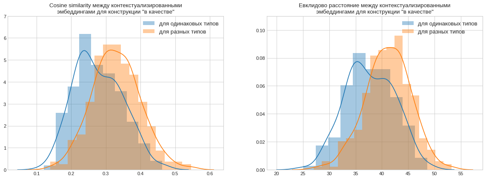
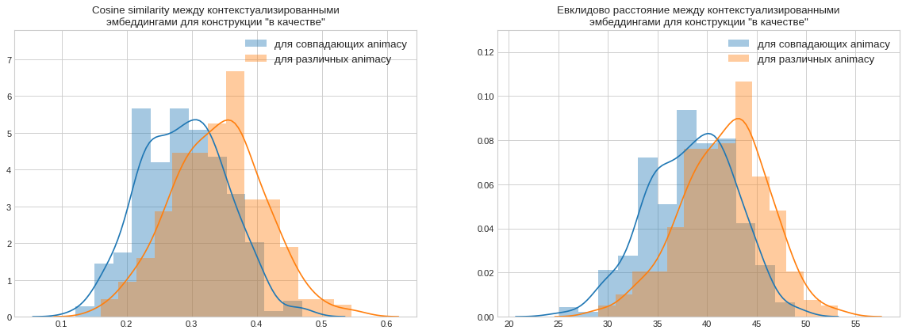
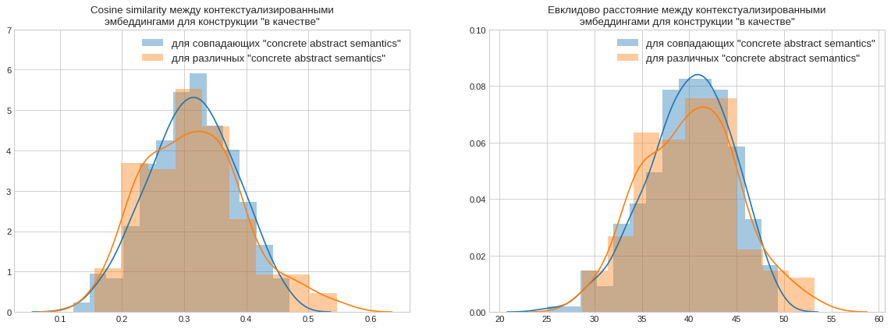
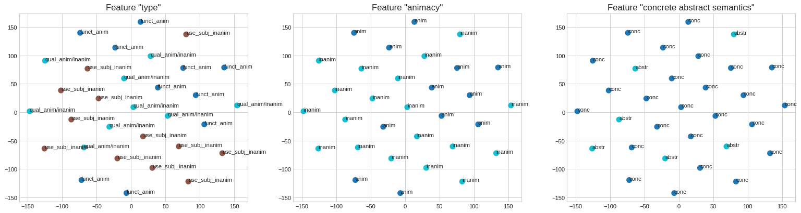
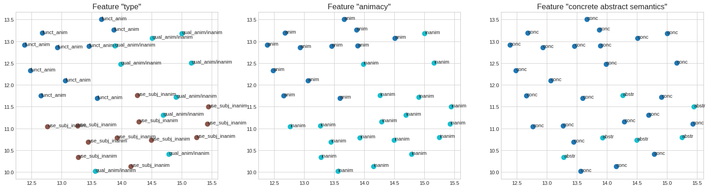

# Linguistic data retrieval and analysis with BERT

### Цель проекта: 
В докладе по ссылке были выдвинуты несколько гипотез относительно эмббедингов в BERT. Цель этого проект проверить гипотезы для русского языка.

https://laurenthelinguist.files.wordpress.com/2019/08/sle_2019_bert.pdf

Язык исследования: **русский**.

### Вопросы для исследования:
* Могут ли модели контекстного прогнозирования, такие как Берт, помочь нам более эффективно определять различные виды использования омонимичных/многозначных слов/словосочетаний? Другими словами, можем ли мы использовать эти модели для семантического поиска?
* Могут ли эти модели сказать что-то о том, как близки/далеки
смыслы многозначных слов/словосочетаний между собой?
* Можно ли при помощи эмбеддингов из берта определять относится слово к одушевленному или неодушевленному объекту?
* Можно ли при помощи эмбеддингов определять относится слово к абстрактному или конкретному объекту?

Но для начала давайте научимся извлекать эмбеддинги из БЕРТа. В данном ноутбуке я буду использовать предобученную модель RuBERT от DeepPavlov.


```python
import torch
import numpy as np
import umap
import matplotlib.pyplot as plt
import seaborn as sns

from sklearn.manifold import TSNE
from sklearn.preprocessing import StandardScaler

from deeppavlov.core.common.file import read_json
from deeppavlov import build_model, configs
from matplotlib import cm
from transformers import BertTokenizer, BertModel
```


```python
tokenizer = BertTokenizer.from_pretrained('./drive/My Drive/datasets/rubert_cased_L-12_H-768_A-12_pt/')
```


```python
text = "После посещения банка он отправился домой, где его ждала банка огурцов и вызов в суд от банка ВТБ."
marked_text = "[CLS] " + text + " [SEP]"

tokenized_text = tokenizer.tokenize(marked_text)

print (tokenized_text)
```

    ['[CLS]', 'после', 'посещения', 'банка', 'он', 'отправился', 'дом', '##ои', ',', 'где', 'его', 'ждала', 'банка', 'огур', '##цов', 'и', 'вызов', 'в', 'суд', 'от', 'банка', 'вт', '##б', '.', '[SEP]']


```python
indexed_tokens = tokenizer.convert_tokens_to_ids(tokenized_text)

for tup in zip(tokenized_text, indexed_tokens):
    print('{:<12} {:>6,}'.format(tup[0], tup[1]))
```

    [CLS]           101
    после         3,468
    посещения    30,674
    банка        15,232
    он            2,886
    отправился   16,505
    дом           4,439
    ##ои         15,484
    ,               128
    где           4,206
    его           2,752
    ждала        85,206
    банка        15,232
    огур         69,879
    ##цов         8,621
    и               851
    вызов        27,651
    в               845
    суд           4,350
    от            1,641
    банка        15,232
    вт           36,607
    ##б             844
    .               132
    [SEP]           102


```python
segments_ids = [1] * len(tokenized_text)
print (segments_ids)
```

    [1, 1, 1, 1, 1, 1, 1, 1, 1, 1, 1, 1, 1, 1, 1, 1, 1, 1, 1, 1, 1, 1, 1, 1, 1]


```python
tokens_tensor = torch.tensor([indexed_tokens])
segments_tensors = torch.tensor([segments_ids])
```


```python
model = BertModel.from_pretrained('./drive/My Drive/datasets/rubert_cased_L-12_H-768_A-12_pt/',
                                  output_hidden_states = True)
model.eval()
```

```python
with torch.no_grad():
    outputs = model(tokens_tensor, segments_tensors)
    hidden_states = outputs[2]
```


```python
token_embeddings = torch.stack(hidden_states, dim=0)
token_embeddings.size()
```


    torch.Size([13, 1, 25, 768])


```python
token_embeddings = torch.squeeze(token_embeddings, dim=1)
token_embeddings.size()
```


    torch.Size([13, 25, 768])


```python
token_embeddings = token_embeddings.permute(1,0,2)
token_embeddings.size()
```


    torch.Size([25, 13, 768])


```python
token_vecs_sum = []

for token in token_embeddings:
    sum_vec = torch.sum(token[-4:], dim=0)
    token_vecs_sum.append(sum_vec)

print ('Форма при суммировании: %d x %d' % (len(token_vecs_sum), len(token_vecs_sum[0])))
```

    Форма при суммировании: 25 x 768


```python
for i, token_str in enumerate(tokenized_text):
  print (i, token_str)
```

    0 [CLS]
    1 после
    2 посещения
    3 банка
    4 он
    5 отправился
    6 дом
    7 ##ои
    8 ,
    9 где
    10 его
    11 ждала
    12 банка
    13 огур
    14 ##цов
    15 и
    16 вызов
    17 в
    18 суд
    19 от
    20 банка
    21 вт
    22 ##б
    23 .
    24 [SEP]


```python
print('Первые пять значений эмбеддинга для каждого инстанса "[банка]".')
print('')
print("посещения банка  ", str(token_vecs_sum[3][:5]))
print("банка огурцов    ", str(token_vecs_sum[12][:5]))
print("банка втб        ", str(token_vecs_sum[20][:5]))
```

    Первые пять значений эмбеддинга для каждого инстанса "[банка]".
    
    посещения банка   tensor([-1.1310, -3.1297, -2.1542,  1.6008,  0.1390])
    банка огурцов     tensor([ 4.4749, -3.5712, -1.6735,  1.5944, -3.0401])
    банка втб         tensor([ 0.0229, -4.8718,  3.0112,  1.5450,  1.7772])


```python
from scipy.spatial.distance import cosine, euclidean

diff_bank = 1 - cosine(token_vecs_sum[3], token_vecs_sum[12])
diff_dist = euclidean(token_vecs_sum[3], token_vecs_sum[12])

same_bank = 1 - cosine(token_vecs_sum[3], token_vecs_sum[20])
same_dist = euclidean(token_vecs_sum[3], token_vecs_sum[20])

print('Косинусная близость векторов для похожих смыслов:  %.2f. Евклидово расстояние: %.3f' % (same_bank, same_dist))
print('Косинусная близость векторов для разных  смыслов:  %.2f. Евклидово расстояние: %.3f' % (diff_bank, diff_dist))
```

    Косинусная близость векторов для похожих смыслов:  0.73. Евклидово расстояние: 65.532
    Косинусная близость векторов для разных  смыслов:  0.56. Евклидово расстояние: 84.254


Неплохо. Кажется, что контекстуализированные эмбеддинги могут работать и в русском языке.

Проверять гипотезы буду используя датасет с различными употреблениями конструкции "в качестве".


```python
import pandas as pd
```


```python
data = pd.read_excel(r'./drive/My Drive/datasets/quality.xlsx', skiprows=1)   
df = pd.DataFrame(data)
```


```python
df.describe()
```


<div>
<style scoped>
    .dataframe tbody tr th:only-of-type {
        vertical-align: middle;
    }

    .dataframe tbody tr th {
        vertical-align: top;
    }

    .dataframe thead th {
        text-align: right;
    }
</style>
<table border="1" class="dataframe">
  <thead>
    <tr style="text-align: right;">
      <th></th>
      <th>text</th>
      <th>type</th>
      <th>animacy</th>
      <th>concrete abstract semantics</th>
    </tr>
  </thead>
  <tbody>
    <tr>
      <th>count</th>
      <td>31</td>
      <td>31</td>
      <td>31</td>
      <td>31</td>
    </tr>
    <tr>
      <th>unique</th>
      <td>31</td>
      <td>3</td>
      <td>2</td>
      <td>2</td>
    </tr>
    <tr>
      <th>top</th>
      <td>Сам плуг в качестве бесценного дара был сброше...</td>
      <td>use_subj_inanim</td>
      <td>inanim</td>
      <td>conc</td>
    </tr>
    <tr>
      <th>freq</th>
      <td>1</td>
      <td>12</td>
      <td>19</td>
      <td>25</td>
    </tr>
  </tbody>
</table>
</div>


```python
dict(df.loc[1])
```


    {'animacy': 'anim',
     'concrete abstract semantics': 'conc',
     'text': 'Однако все, чего ему удалось добиться ― это вернуться в свою компанию в качестве технического директора.  ',
     'type': 'funct_anim'}


```python
tokenizer.tokenize(df.loc[1].text)
```


    ['однако',
     'все',
     ',',
     'чего',
     'ему',
     'удалось',
     'добиться',
     '―',
     'это',
     'вернуться',
     'в',
     'свою',
     'компанию',
     'в',
     'качестве',
     'технического',
     'директора',
     '.']


```python
df["embs"] = None
```


```python
def get_embedding(text, tokenizer, mask=False):
    marked_text = "[CLS] " + text + " [SEP]"

    tokenized_text = tokenizer.tokenize(marked_text)

    if mask:
        tokenized_text[tokenized_text.index("качестве") - 1] = "[MASK]"

    indexed_tokens = tokenizer.convert_tokens_to_ids(tokenized_text)
    segments_ids = [1] * len(tokenized_text)
    tokens_tensor = torch.tensor([indexed_tokens])
    segments_tensors = torch.tensor([segments_ids])
    with torch.no_grad():
        outputs = model(tokens_tensor, segments_tensors)
        hidden_states = outputs[2]

    token_embeddings = torch.stack(hidden_states, dim=0)
    token_embeddings = torch.squeeze(token_embeddings, dim=1)
    token_embeddings = token_embeddings.permute(1,0,2)

    token = token_embeddings[tokenized_text.index("качестве")]
    return torch.cat((token[-1], token[-2], token[-3], token[-4]), dim=0).numpy()
    # return torch.sum(token[-4:], dim=0).numpy()
    # return torch.cat((torch.sum(token_embeddings[tokenized_text.index("качестве") - 1][-4:], dim=0), 
    #                   torch.sum(token_embeddings[tokenized_text.index("качестве")][-4:], dim=0)), 0).numpy()
```


```python
for i in range(len(df)):
    df.loc[i]['embs'] = get_embedding(df.loc[i]["text"], tokenizer, False)
df.head()
```


<div>
<style scoped>
    .dataframe tbody tr th:only-of-type {
        vertical-align: middle;
    }

    .dataframe tbody tr th {
        vertical-align: top;
    }

    .dataframe thead th {
        text-align: right;
    }
</style>
<table border="1" class="dataframe">
  <thead>
    <tr style="text-align: right;">
      <th></th>
      <th>text</th>
      <th>type</th>
      <th>animacy</th>
      <th>concrete abstract semantics</th>
      <th>embs</th>
    </tr>
  </thead>
  <tbody>
    <tr>
      <th>0</th>
      <td>Поскольку постановление о приводе Самсонова в ...</td>
      <td>funct_anim</td>
      <td>anim</td>
      <td>conc</td>
      <td>[0.27083465, -0.91712666, 0.085353985, 0.13764...</td>
    </tr>
    <tr>
      <th>1</th>
      <td>Однако все, чего ему удалось добиться ― это ве...</td>
      <td>funct_anim</td>
      <td>anim</td>
      <td>conc</td>
      <td>[0.7635945, -0.99202764, 0.2629664, -0.1398050...</td>
    </tr>
    <tr>
      <th>2</th>
      <td>Ему дали путевку на курорт, стало быть, и врем...</td>
      <td>funct_anim</td>
      <td>anim</td>
      <td>conc</td>
      <td>[0.39002886, -1.3964953, -0.54386973, 0.177590...</td>
    </tr>
    <tr>
      <th>3</th>
      <td>Первый её выезд в качестве взрослой девицы был...</td>
      <td>funct_anim</td>
      <td>anim</td>
      <td>conc</td>
      <td>[0.4158289, -0.41065425, -0.26629108, -0.09222...</td>
    </tr>
    <tr>
      <th>4</th>
      <td>Он вызывает тебя на суд в качестве обвиняемого…</td>
      <td>funct_anim</td>
      <td>anim</td>
      <td>conc</td>
      <td>[0.13565326, -0.30301222, -0.32744023, -0.1784...</td>
    </tr>
  </tbody>
</table>
</div>


Посмотрю на распределение cosine similarity и евклидова расстояния между векторами с совпадающими и различными значениями признаков.


```python
same_type_similarity, different_type_similarity = [[], []], [[], []]
same_animacy_similarity, different_animacy_similarity = [[], []], [[], []]
same_semantic_similatiry, different_semantic_similarity = [[], []], [[], []]

for i in range(len(df)):
    for j in range(i):
        cosine_similarity = cosine(df.loc[i].embs, df.loc[j].embs)
        euclidian_distance = euclidean(df.loc[i].embs, df.loc[j].embs)

        if df.loc[i].type == df.loc[j].type:
            same_type_similarity[0].append(cosine_similarity)
            same_type_similarity[1].append(euclidian_distance)
        else:
            different_type_similarity[0].append(cosine_similarity)
            different_type_similarity[1].append(euclidian_distance)
        
        if df.loc[i].animacy == df.loc[j].animacy:
            same_animacy_similarity[0].append(cosine_similarity)
            same_animacy_similarity[1].append(euclidian_distance)
        else:
            different_animacy_similarity[0].append(cosine_similarity)
            different_animacy_similarity[1].append(euclidian_distance)

        if df.loc[i]["concrete abstract semantics"] == df.loc[j]["concrete abstract semantics"]:
            same_semantic_similatiry[0].append(cosine_similarity)
            same_semantic_similatiry[1].append(euclidian_distance)
        else:
            different_semantic_similarity[0].append(cosine_similarity)
            different_semantic_similarity[1].append(euclidian_distance)

```


```python
plt.figure(figsize=(18, 6))
plt.style.use('seaborn-whitegrid')

plt.subplot(1, 2, 1)
sns.distplot(same_type_similarity[0], label="для одинаковых типов", )
sns.distplot(different_type_similarity[0], label="для разных типов")
plt.title("Cosine similarity между контекстуализированными\n"
          "эмбеддингами для конструкции \"в качестве\"")
plt.legend(fontsize=12, loc=1)
plt.ylim((0, 7))

plt.subplot(1, 2, 2)
sns.distplot(same_type_similarity[1], label="для одинаковых типов")
sns.distplot(different_type_similarity[1], label="для разных типов")
plt.title("Евклидово расстояние между контекстуализированными\n"
          "эмбеддингами для конструкции \"в качестве\"")
plt.legend(fontsize=12, loc=1)
plt.ylim((0, 0.11))

plt.show()
```





```python
plt.figure(figsize=(18, 6))

plt.subplot(1, 2, 1)
sns.distplot(same_animacy_similarity[0], label="для совпадающих animacy")
sns.distplot(different_animacy_similarity[0], label="для различных animacy")
plt.title("Cosine similarity между контекстуализированными\n"
          "эмбеддингами для конструкции \"в качестве\"")
plt.legend(fontsize=12, loc=1)
plt.ylim((0, 7.8))

plt.subplot(1, 2, 2)
sns.distplot(same_animacy_similarity[1], label="для совпадающих animacy")
sns.distplot(different_animacy_similarity[1], label="для различных animacy")
plt.title("Евклидово расстояние между контекстуализированными\n" 
          "эмбеддингами для конструкции \"в качестве\"")
plt.legend(fontsize=12, loc=1)
plt.ylim((0, 0.13))

plt.show()
```





```python
plt.figure(figsize=(18, 6))

plt.subplot(1, 2, 1)
sns.distplot(same_semantic_similatiry[0], 
             label="для совпадающих \"concrete abstract semantics\"")
sns.distplot(different_semantic_similarity[0], 
             label="для различных \"concrete abstract semantics\"")
plt.title("Cosine similarity между контекстуализированными\n" 
          "эмбеддингами для конструкции \"в качестве\"")
plt.legend(fontsize=12)
plt.ylim((0, 7))

plt.subplot(1, 2, 2)
sns.distplot(same_semantic_similatiry[1], 
             label="для совпадающих \"concrete abstract semantics\"")
sns.distplot(different_semantic_similarity[1], 
             label="для различных \"concrete abstract semantics\"")
plt.title("Евклидово расстояние между контекстуализированными\n" 
          "эмбеддингами для конструкции \"в качестве\"")
plt.legend(fontsize=12, loc=1)
plt.ylim((0, 0.1))

plt.show()
```





Контринтуитивно, что при группировке по фичам type и animacy cosine similarity между векторами  из разных групп в среднем выше, чем между вектора с одинаковыми значениями фичей. Различия для "concrete abstract semantics" отсутствуют.

Возможно, cosine similarity не лучший способ оценивать похожесть векторов. Если смотреть на распределение евклидова расстояния между векторами, то можно заметить следующее:
* вектора с различными значениями фичи "types" в среднем находятся дальше друг от друга
* вектора с различными значениями фичи "animacy" в среднем находятся дальше друг от друга
*значениями фичи "concrete abstract semantics" не влияют на евклидово расстояние между векторами

Спроецирую эмбеддинги на плоскость чтобы визуально оценить их близость и понять, происходит ли кластеризация. Применю t-SNE для этого, как в оригинальном докладе.


```python
def scatter_2d(x, df):
    plt.figure(figsize=(24, 6))
    plt.rcParams['figure.dpi'] = 80
    
    plt.subplot(1, 3, 1)
    types = list(df.type.unique())
    colours = list(map(lambda x: types.index(x), df.type.values))
    cmap = cm.get_cmap('tab10', len(colours))
    for i in range(len(df)):
        plt.text(x[i, 0], x[i, 1], df.type.values[i])
    plt.scatter(x[:, 0], x[:, 1], c=colours, cmap=cmap, lw=4)
    plt.title("Feature \"type\"", fontsize=15)


    plt.subplot(1, 3, 2)
    animacy = list(df.animacy.unique())
    colours = list(map(lambda x: animacy.index(x), df.animacy.values))
    cmap = cm.get_cmap('tab10', len(colours))
    for i in range(len(df)):
        plt.text(x[i, 0], x[i, 1], df.animacy.values[i])
    plt.scatter(x[:, 0], x[:, 1], c=colours, cmap=cmap, lw=4)
    plt.title("Feature \"animacy\"", fontsize=15)


    plt.subplot(1, 3, 3)
    semantic = list(df["concrete abstract semantics"].unique())
    colours = list(map(lambda x: semantic.index(x), df["concrete abstract semantics"].values))
    cmap = cm.get_cmap('tab10', len(colours))
    for i in range(len(df)):
        plt.text(x[i, 0], x[i, 1], df["concrete abstract semantics"].values[i])
    plt.scatter(x[:, 0], x[:, 1], c=colours, cmap=cmap, lw=4)
    plt.title("Feature \"concrete abstract semantics\"", fontsize=15)

    plt.show()
```


```python
numpy_embeddings = np.zeros((len(df.embs), len(df.loc[1].embs)))
for i in range(len(df.embs)):
    numpy_embeddings[i, :] = df.loc[i].embs
```


```python
numpy_embeddings_norm = StandardScaler().fit_transform(numpy_embeddings)
tsne = TSNE(n_components=2)
numpy_embeddings_tsne = tsne.fit_transform(numpy_embeddings_norm)
```


```python
scatter_2d(numpy_embeddings_tsne, df)
```





Явная кластеризация отсутствует, попробую применить более продвинутый алгоритм UMAP.


```python
numpy_embeddings_umap = umap.UMAP().fit_transform(numpy_embeddings)
```


```python
scatter_2d(numpy_embeddings_umap, df)
```





Бинго, наблюдается отличная кластеризация по фиче "animacy" и с небольшим количеством misclassification по фиче "type".

По фиче "concrete abstract semantics" кластеризации нет, хоть и вектора со значением "abstr" находятся рядом друг с другом.

Попытки брать в качестве эмбеддингов не конкатенацию  векторов для токена "качестве" c последних четырех слоев, а что-нибудь другое, например конкатенацию сумм с последних четырех слоев дл токенов "в" и "качестве", не привели к улучшению кластеризации по фиче  "concrete abstract semantics".

### Итог:

* Может ли берт различать смыслы слов в русском языке? **Да, может.**
* Возможно ли измерять близость слов используя берт? **Да.**
* Можно ли при помощи эмбеддингов из берта определять относится слово к одушвленному или неодушевленному объекту? **Да, можно.**
* Можно ли при помощи эмбеддингов определять относится слово к абстрактному или конкретному объекту. **Подтверждений не обнаружено.**
